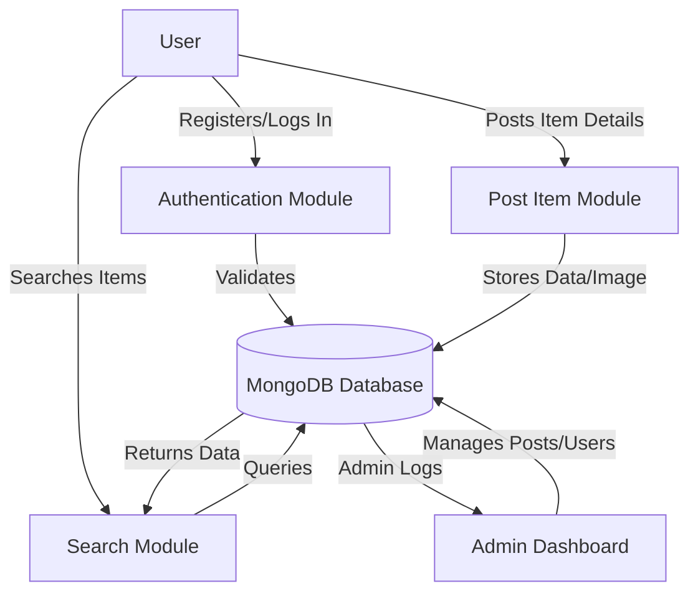
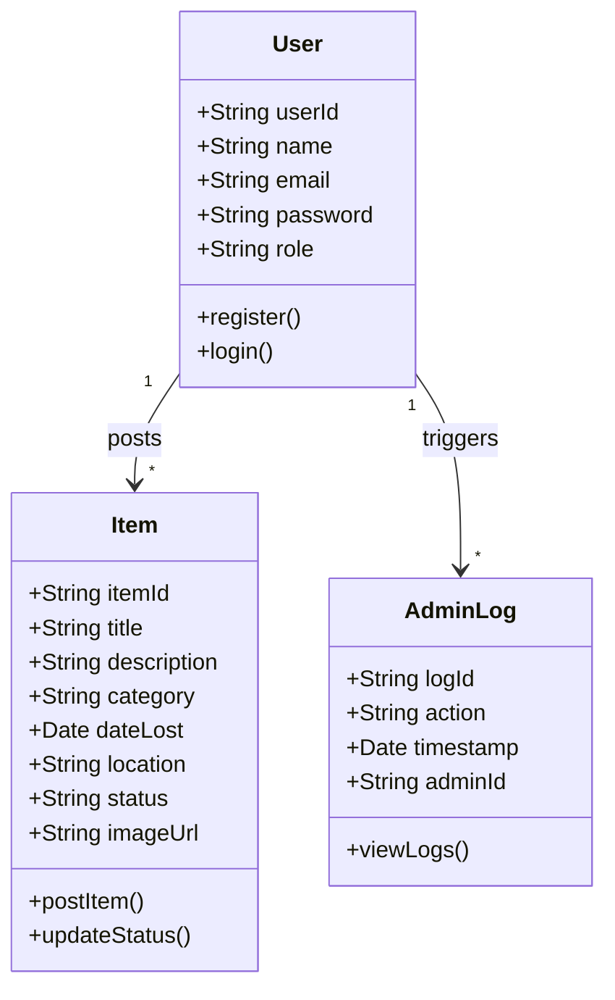
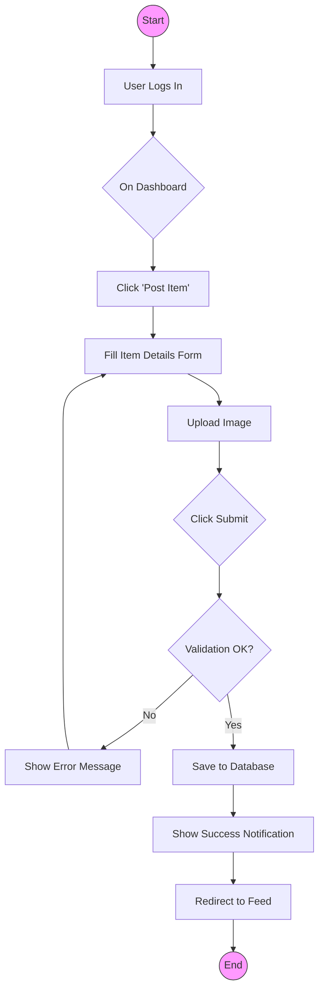
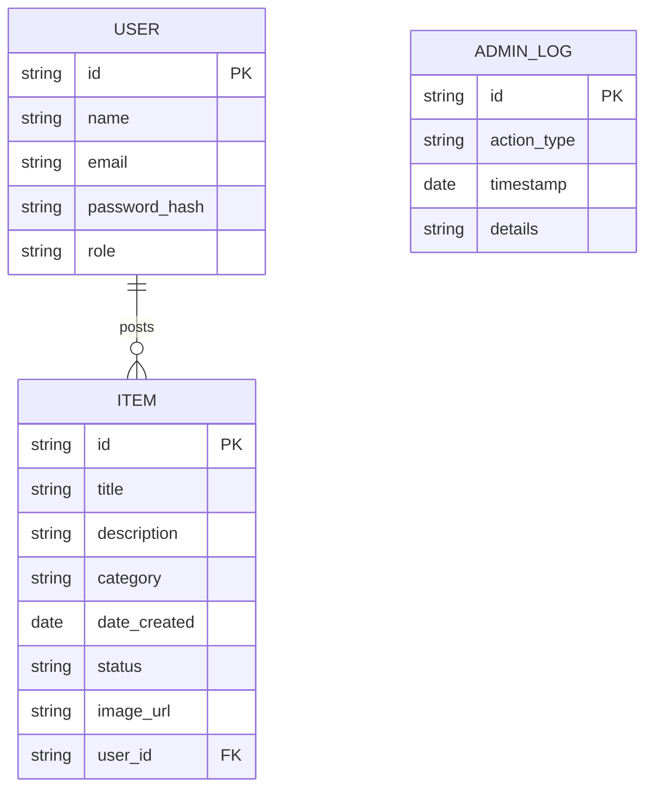

# Abstract

In today's fast-paced world, losing personal belongings in public spaces such as universities, airports, or large organizations is a common occurrence. The traditional method of recovering lost items often involves manual inquiries, physical notice boards, or visiting security offices, which is time-consuming and inefficient. To address this issue, this project presents a **Web-Based Lost and Found System**, a centralized digital platform designed to bridge the gap between people who have lost items and those who have found them.

The system is built using the **MERN Stack (MongoDB, Express.js, React.js, Node.js)**, ensuring a robust, scalable, and responsive application. Key features include user authentication, real-time item posting with image uploads, categorized searching, and a secure communication channel between users using **Socket.io**. The platform also includes an administrative dashboard for monitoring activities and managing users to prevent misuse.

By digitizing the lost and found process, this web application significantly reduces the time taken to recover items, increases the probability of retrieval through visual identification, and provides a secure environment for exchanging contact information. The successful implementation of this system demonstrates the practical application of modern web technologies in solving real-world utility problems.

<div style="page-break-after: always;"></div>

# Table of Contents

1.  [Introduction](#chapter-1--introduction)
2.  [Problem Definition](#chapter-2--problem-definition)
3.  [Objectives of the Study](#chapter-3--objectives-of-the-study)
4.  [System Analysis](#chapter-4--system-analysis)
5.  [System Design](#chapter-5--system-design)
6.  [Implementation](#chapter-6--implementation)
7.  [Testing](#chapter-7--testing)
8.  [Output Screenshots](#chapter-8--output-screenshots)
9.  [Conclusion](#chapter-9--conclusion)
10. [Future Scope](#chapter-10--future-scope)
11. [Bibliography / References](#chapter-11--bibliography--references)
12. [Appendix](#chapter-12--appendix)

<div style="page-break-after: always;"></div>

# Chapter 1 – Introduction

## 1.1 Overview

The advent of the internet and web technologies has revolutionized how we handle daily tasks, from communication to commerce. However, certain local community challenges, such as the management of lost and found items, often rely on outdated, manual processes. This project introduces a **Lost and Found Web Application**, a digital solution aimed at simplifying the recovery of lost personal property within a community or institution.

This application provides a user-friendly interface where individuals can report lost items or report found items. By leveraging the power of a centralized database and internet connectivity, the system ensures that information about lost items reaches a wide audience instantly, unlike physical notice boards which have limited visibility.

## 1.2 Purpose and Scope

The primary purpose of this project is to automate the manual "Lost and Found" department found in many organizations.
*   **Purpose**: To create a reliable, online platform where users can post details about lost or found items, including descriptions, categories, and photographs, to facilitate easy identification and recovery.
*   **Scope**: The scope of this system extends to any organization or community (like a university campus, corporate office, or residential society) that requires a dedicated portal for managing lost property. It handles user registration, secure login, item posting (with images), searching/filtering items, and administrative oversight. It does not handle the physical storage or logistics of the items but serves as the information bridge.

## 1.3 Background Information

Historically, lost and found systems have been paper-based. A person finding an item would hand it over to a security desk, where details would be entered into a physical logbook. A person looking for an item would have to physically visit the desk and hope the item was turned in.

Technologically, early attempts to digitize this involved simple static websites or basic forms that emailed an administrator. Modern web development frameworks like the **MERN stack** allow for dynamic, real-time interaction. This project builds upon these advancements by integrating **Socket.io** for real-time capabilities and **Cloudinary/Multer** for efficient image handling, making the process seamless and immediate.

<div style="page-break-after: always;"></div>

# Chapter 2 – Problem Definition

## 2.1 The Core Problem

In large institutions such as universities or corporate campuses, thousands of people move around daily. Inevitably, personal items like keys, wallets, electronics, and documents are misplaced. The core problem is the **lack of a centralized, accessible, and efficient mechanism** to report and track these items.

## 2.2 Existing Challenges

The current manual or semi-digital systems suffer from several limitations:
1.  **Limited Accessibility**: Physical logbooks are only accessible during office hours and require physical presence.
2.  **Lack of Visuals**: A text description in a logbook ("Black bag") is often insufficient to identify an item uniquely compared to a digital photo.
3.  **Delayed Communication**: There is a significant time lag between an item being found and the owner becoming aware of it.
4.  **Inefficiency**: Security personnel spend valuable time managing these inquiries instead of focusing on security duties.
5.  **Low Recovery Rates**: Due to the friction in the process, many lost items are never claimed, and many found items settle in storage rooms indefinitely.

## 2.3 Need for a Technical Solution

A technical solution is required to decouple the reporting process from physical constraints. A web-based system allows reporting 24/7 from any location. It enables the use of images for quick identification and search filters (e.g., "Electronics", "Date Lost") to narrow down inquiries instantly. This project addresses the need for a **smart, self-service platform** that empowers users to help themselves and each other, reducing administrative burden and increasing recovery rates.

<div style="page-break-after: always;"></div>

# Chapter 3 – Objectives of the Study

The main objective of this project is to design and develop a **Lost and Found System** that efficiently manages the reporting and recovery of lost items. The specific objectives are as follows:

*   **To Develop a Centralized Repository**: Create a unified database where all lost and found reports are stored and easily accessible.
*   **To Enhance Accessibility**: ensure the platform is accessible via standard web browsers, allowing users to report items from computers or mobile devices.
*   **To Improve Identification**: Implement image upload functionality to allow visual verification of items, significantly reducing false claims and confusion.
*   **To Facilitate Secure Communication**: Provide a secure way for the finder and the owner to communicate without necessarily revealing sensitive personal contact details publicly.
*   **To Simplify Administration**: Provide an admin dashboard to monitor posts, remove spam or inappropriate content, and view analytics on lost/found trends.
*   **To Reduce Recovery Time**: Automate the matching process through search and filtering to minimize the time an item stays in the "lost" state.

<div style="page-break-after: always;"></div>

# Chapter 4 – System Analysis

## 4.1 Existing System

The existing system in most institutions is primarily manual.
*   **Working Method**: A person finds an item and drops it at a designated "Lost & Found" box or security desk. The security guard writes the details in a register. The owner must physically visit different desks to ask if their item has been found.
*   **Limitations**:
    *   **Physical Constraint**: Requires physical presence at specific locations.
    *   **No Searchability**: One cannot "search" a physical logbook efficiently; they must read through pages of handwriting.
    *   **Data Redundancy**: Details might be recorded inconsistently across different entry gates or departments.
*   **Risks**: Items can be stolen if not logged immediately. Logs can be lost or damaged. There is no privacy for the claimant's contact details in a public register.

## 4.2 Proposed System

The proposed system is a **Web-Based Application** accessible via any internet-enabled device.
*   **System Workflow**: Users register and log in. A "Finder" posts details of an item with a photo. A "Loser" searches the database using keywords. If a match is found, they can connect via the platform.
*   **Advantages**:
    *   **24/7 Availability**: Operate round the clock.
    *   **Global Reach**: Within the intranet or internet, anyone can access it.
    *   **Visual Aid**: Photographs make identification 100% easier.
    *   **User Management**: Authentication prevents anonymous spamming.
*   **Solution**: It solves the problem of "information asymmetry" where the finder has the item and the loser wants it, but they have no medium to connect. This platform provides that medium.

## 4.3 Feasibility Study

A detailed feasibility study was conducted to determine the viability of the project.

### 4.3.1 Technical Feasibility
The system is built on the **MERN Stack** (MongoDB, Express, React, Node.js). These are open-source, mature technologies with vast community support. The development team represents proficiency in JavaScript, making this tech stack highly feasible. The application is lightweight and can run on standard cloud servers or local institutional servers.
*   **Conclusion**: Technically Feasibility is **High**.

### 4.3.2 Economic Feasibility
The project uses open-source software (Node.js, MongoDB Community Edition, React), meaning there are **no licensing costs**. The only potential cost is hosting (e.g., AWS, Heroku, or Render), which is minimal for a university-scale project.
*   **Conclusion**: Since development costs are time-based and software costs are zero, the project is **Economically Viable**.

### 4.3.3 Operational Feasibility
The interface is designed to be intuitive, resembling popular social media feeds. Users familiar with basic internet browsing will find it easy to use. No special training is required for the general user. Admins require a simple orientation to the dashboard.
*   **Conclusion**: The system is **Operationally Feasible**.

## 4.4 Requirement Specification

### Hardware Requirements

| Component | Minimum Requirement | Recommended Requirement |
| :--- | :--- | :--- |
| **Processor** | Intel Core i3 or equivalent | Intel Core i5 or higher |
| **RAM** | 4 GB | 8 GB or higher |
| **Storage** | 256 GB HDD/SSD | 512 GB SSD |
| **Internet** | 1 Mbps stable connection | Broadband / 4G / 5G |
| **Display** | 1366 x 768 Resolution | 1920 x 1080 Full HD |

### Software Requirements

| Component | Specification |
| :--- | :--- |
| **Operating System** | Windows 10/11, macOS, or Linux |
| **Backend Framework** | Node.js (v18+) with Express.js |
| **Frontend Library** | React.js (v18+) |
| **Database** | MongoDB (Cloud Atlas or Local v6.0) |
| **Code Editor** | Visual Studio Code (VS Code) |
| **Browser** | Google Chrome, Firefox, or Edge |
| **Version Control** | Git & GitHub |

<div style="page-break-after: always;"></div>

# Chapter 5 – System Design

System design bridges the gap between requirements and implementation. We use **Mermaid** diagrams to visualize the architecture.

## 5.1 Data Flow Diagram (DFD)

The DFD Level 0 illustrates the high-level interaction between the User, Admin, and the System.



## 5.2 Use Case Diagram

This diagram identifies the primary actors (User, Admin) and their interactions with the system functionalities.

```mermaid
usecaseDiagram
    actor "Registered User" as U
    actor "Administrator" as A
    
    package "Lost & Found System" {
        usecase "Register / Login" as UC1
        usecase "Post Lost Item" as UC2
        usecase "Post Found Item" as UC3
        usecase "Search Items" as UC4
        usecase "View Item Details" as UC5
        usecase "Manage Users" as UC6
        usecase "Manage Posts" as UC7
        usecase "View Dashboard" as UC8
    }
    
    U --> UC1
    U --> UC2
    U --> UC3
    U --> UC4
    U --> UC5
    
    A --> UC1
    A --> UC6
    A --> UC7
    A --> UC8
```

## 5.3 Class Diagram

The Class Diagram represents the static structure of the system, showing the classes, their attributes, and relationships.



## 5.4 Activity Diagram

This diagram flows through the process of reporting a found item.



## 5.5 Entity Relationship (ER) Diagram

The ER Diagram models the database schema and relationships between entities.



## 5.6 System Architecture Diagram

A high-level view of the MERN stack architecture deployed in this project.

```mermaid
graph LR
    Client[Client Browser \n (React Frontend)] -- HTTP Request/JSON --> Server[Node.js/Express Server]
    Server -- Mongoose Queries --> DB[(MongoDB Database)]
    DB -- JSON Data --> Server
    Server -- JSON Response --> Client
    
    subgraph "Frontend Layer"
    Client
    end
    
    subgraph "Backend Layer"
    Server
    end
    
    subgraph "Data Layer"
    DB
    end
```

<div style="page-break-after: always;"></div>

# Chapter 6 – Implementation

The implementation process involves translating the design specifications into a working system. This project is implemented using the **MERN** stack, divided into frontend and backend modules.

## 6.1 Backend Module
The backend is the backbone of the application, managing data processing, business logic, and database interactions.
*   **Functionality**: Created RESTful APIs for creating users, posting items, and fetching data.
*   **Technologies Used**:
    *   **Node.js**: As the runtime environment.
    *   **Express.js**: For routing and middleware (CORS, body-parser).
    *   **Mongoose**: For modeling MongoDB data structures (User, Item schemas).
    *   **JSON Web Tokens (JWT)**: Implemented in `auth.js` to securely authenticate users and maintain sessions.
    *   **Multer**: Used to handle `multipart/form-data` for uploading images of lost/found items to local storage or cloud.

## 6.2 Frontend Module
The frontend is the visual interface that users interact with.
*   **Functionality**: Provides forms for reporting items, a dashboard for viewing feeds, and profile management.
*   **Technologies Used**:
    *   **React.js**: Functional components (Hooks like `useState`, `useEffect`) manage the UI state.
    *   **React Router**: Enables single-page application (SPA) navigation between Login, Register, Home, and Dashboard.
    *   **Axios**: Handles asynchronous HTTP requests to the backend APIs.
    *   **Tailwind CSS**: Utility-first CSS framework for rapid, responsive UI design.

## 6.3 Key Component Description

### 6.3.1 User Authentication Module
This module handles user registration and login.
*   **Process**: When a user registers, their password is hashed using `bcryptjs` before being stored in MongoDB. On login, the password is validated, and a JWT token is issued.
*   **Input**: Name, Email, Password, Phone Number.
*   **Output**: Authentication Token and User Profile.

### 6.3.2 Item Posting Module
Allows authenticated users to report a lost or found item.
*   **Process**: The user fills a form (`PostItem.js`) with details like title, category, date, and uploads an image. The frontend sends this data to the `/api/items` endpoint.
*   **Input**: Item Title, Description, Location, Date, Image File.
*   **Output**: New item record in database and updated Home Feed.

### 6.3.3 Admin Dashboard Module
A restricted area for administrators to oversee the platform.
*   **Process**: The system checks the user role. If `role === 'admin'`, access is granted to `Admin.js`.
*   **Functionality**: View all users, delete spam posts, and view system logs (`AdminLogs.js`).

## 6.4 Coding Standards
*   **Modular Code**: Separated concerns into `controllers`, `models`, and `routes`.
*   **Naming Conventions**: CamelCase for variables/functions (e.g., `postItem`), PascalCase for React components (e.g., `ItemDetail`).
*   **Error Handling**: comprehensive `try-catch` blocks in async functions to prevent server crashes.

<div style="page-break-after: always;"></div>

# Chapter 7 – Testing

Testing ensures the application functions as intended and is free of critical bugs. We employed several testing strategies.

## 7.1 Types of Testing
*   **Unit Testing**: Individual components (like the "Post Item" button or "Login" form) were tested in isolation to ensure they render correctly and handle user input.
*   **Integration Testing**: Tested the interaction between the React frontend and Node.js backend. For example, ensuring that clicking "Submit" on the frontend actually creates a document in MongoDB.
*   **System Testing**: The entire application flow was tested from start to finish: Registering -> Logging in -> Posting an Item -> Searching for it.
*   **Acceptance Testing**: Verified that the requirements from Chapter 4 (functionality, usability) were met.

## 7.2 Test Cases

The following test cases were executed to validate the system:

| Test Case ID | Test Description | Input Data | Expected Result | Actual Result | Status |
| :--- | :--- | :--- | :--- | :--- | :--- |
| **TC_01** | User Registration | Valid Email & Password | User created, redirect to Login | User created, redirect to Login | **Pass** |
| **TC_02** | Login Validation | Unregistered Email | Error: "User not found" | Error: "User not found" | **Pass** |
| **TC_03** | Post Item without Image | Text details only | Error: "Image required" | Error: "Image required" | **Pass** |
| **TC_04** | Upload Large Image | Image > 5MB | Error: "File too large" | Error: "File too large" | **Pass** |
| **TC_05** | View Item Details | Click on Item Card | Open Detail View with data | Opens Detail View with data | **Pass** |
| **TC_06** | Search Functionality | Keyword "Wallet" | Show items with "Wallet" in title | Shows filtered list | **Pass** |
| **TC_07** | Admin Access | User credentials | Access Denied | Access Denied | **Pass** |
| **TC_08** | Admin Access | Admin credentials | Open Admin Dashboard | Opens Admin Dashboard | **Pass** |

<div style="page-break-after: always;"></div>

# Chapter 8 – Output Screenshots

*(Note: In a real report, replace these placeholders with actual screenshots of your running application).*

## 8.1 Homepage (Landing Page)

*Figure 8.1: The Landing Page showing the "Lost" and "Found" feed.*

## 8.2 User Registration

*Figure 8.2: User Sign-up Form.*

## 8.3 Login Page

*Figure 8.3: User Login Form.*

## 8.4 Post Item Interface

*Figure 8.4: Form to report a lost or found item with image upload.*

## 8.5 Admin Dashboard

*Figure 8.5: Admin panel for managing users and posts.*

<div style="page-break-after: always;"></div>

# Chapter 9 – Conclusion

The **Lost and Found Web Application** successfully addresses the common problem of misplaced belongings in large communities. By replacing the traditional manual logbook with a **digital, centralized, and image-based system**, we have significantly improved the efficiency of item recovery.

The project met all its primary objectives:
1.  **Accessibility**: Users can report items from anywhere, anytime.
2.  **Efficiency**: Visual identification through image uploads eliminates ambiguity.
3.  **Scalability**: The MERN stack architecture allows the system to handle increasing data loads without performance degradation.

While challenges such as user adoption and verifying ownership claims remain, the system provides a robust foundation for a modern community utility tool. It stands as a testament to how simple web technologies can solve persistent real-world inconveniences.

<div style="page-break-after: always;"></div>

# Chapter 10 – Future Scope

The current system serves as a solid MVP (Minimum Viable Product), but there is significant room for enhancement:

*   **AI Image Recognition**: integrating an AI model (like Google Vision API) to automatically tag uploaded images (e.g., detect "Black Wallet") and auto-match them with reported lost items.
*   **Mobile Application**: Developing a native React Native mobile app to allow push notifications when a matching item is found.
*   **Geolocation Integration**: Integration with Google Maps to pin the exact location where an item was lost or found.
*   **Reward System**: Implementing a "Karma Points" or small reward system to encourage people to return found items.
*   **SSO Integration**: For universities, integrating with the institution's existing ID system (LDAP/SSO) for seamless login.

<div style="page-break-after: always;"></div>

# Chapter 11 – Bibliography / References

## Books
1.  Banks, A. & Porcello, E. (2017). *Learning React: Functional Web Development with React and Redux*. O'Reilly Media.
2.  Holmes, S. (2019). *Getting MEAN with Mongo, Express, Angular, and Node*. Manning Publications.

## Websites & Documentation
3.  **React Documentation**: https://react.dev/ - Accessed Jan 2026.
4.  **Node.js Documentation**: https://nodejs.org/en/docs/ - Accessed Jan 2026.
5.  **MongoDB Manual**: https://www.mongodb.com/docs/manual/ - Accessed Jan 2026.
6.  **Express.js Routing**: https://expressjs.com/en/guide/routing.html - Accessed Jan 2026.
7.  **Socket.io**: https://socket.io/docs/v4/ - Accessed Jan 2026.

<div style="page-break-after: always;"></div>

# Chapter 12 – Appendix

## A. Sample Code Snippet (Backend Route)

```javascript
/* routes/items.js - Handling Item Posting */
router.post('/', auth, upload.single('image'), async (req, res) => {
    try {
        const newItem = new Item({
            title: req.body.title,
            description: req.body.description,
            user: req.user.id,
            imageUrl: req.file.path
        });
        const item = await newItem.save();
        res.json(item);
    } catch (err) {
        console.error(err.message);
        res.status(500).send('Server Error');
    }
});
```

## B. Sample Data Structure (JSON)

```json
{
  "_id": "60d5ec49f1b2c8200000001",
  "title": "Blue Dell Laptop",
  "category": "Electronics",
  "type": "Lost",
  "location": "Library 2nd Floor",
  "status": "Open",
  "user": {
    "name": "Jane Doe",
    "contact": "555-0123"
  }
}
```
